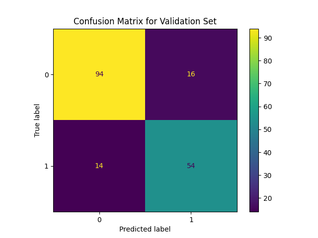
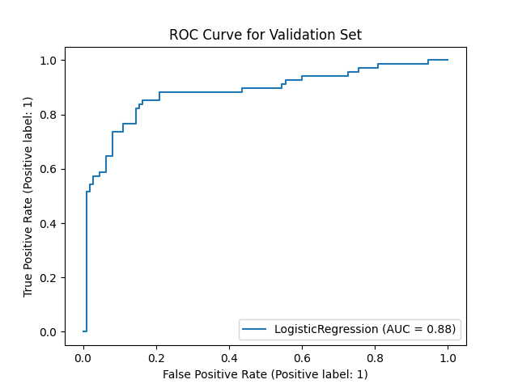

# 🛳️ Titanic Survival Prediction

A Kaggle‑style project that trains a **Logistic Regression** model to predict which passengers survived the Titanic disaster.  
The workflow covers end‑to‑end data handling—cleaning, feature engineering, modelling, and evaluation—and produces a CSV ready for Kaggle submission.

## 📂 Project Structure
```
.
├── titanic_notebook.ipynb          # Full exploratory & modelling notebook           
├── data/
│   ├── train.csv
│   ├── test.csv
│   └── submission.csv
├── visualizations/
│   ├── confusion_matrix.png
│   └── roc_curve.png
└── README.md
```

## 📊 Dataset
- **Source:** Kaggle “Titanic – Machine Learning from Disaster”  
- **Train set:** 891 rows × 12 columns (with `Survived`)  
- **Test set:** 418 rows × 11 columns (no `Survived`)  

Key raw features:

| Column | Description |
| ------ | ----------- |
| `Pclass` | Passenger class (1 = 1st, 2 = 2nd, 3 = 3rd) |
| `Sex` | Gender |
| `Age` | Age in years |
| `SibSp`, `Parch` | # siblings/spouses & parents/children aboard |
| `Fare` | Ticket fare |
| `Embarked` | Port of embarkation (C/Q/S) |
| `Cabin`, `Ticket`, `Name` | Free‑text identifiers (dropped) |

## 🛠️ Methodology

| Step | Highlights |
| ---- | ---------- |
| **1. Cleaning** | Drop high‑cardinality `Name`, `Cabin`, `Ticket`; impute `Age` (mean) & `Fare` (median); drop rows with missing `Embarked`. |
| **2. Feature Engineering** | *Family_Size = SibSp + Parch*; *Is_Alone* flag; categorical *Age_Category* (Child … Senior); log‑scaled *Log_Fare*. |
| **3. Encoding & Scaling** | Binary map `Sex`; One‑Hot encode `Embarked` & `Age_Category`; `StandardScaler` on numeric features. |
| **4. Modelling** | `LogisticRegression` with 80‑20 stratified split; hyperparameters left default for baseline. |
| **5. Evaluation** | Confusion matrix, classification report, ROC‑AUC; validation accuracy ≈ **0.83**. |
| **6. Inference** | Train on full set → predict `Survived` for Kaggle test → save `submission.csv`. |

## 📈 Results

| Metric | Score |
| ------ | ----- |
| Validation Accuracy | **0.831** |
| ROC‑AUC | **0.88** |
| Kaggle Public LB | **0.77033** |

<p align="center">
  
  
</p>

